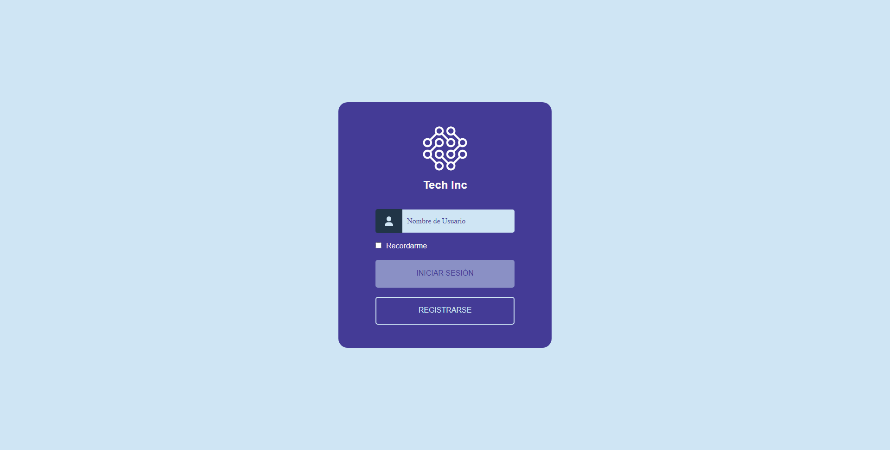
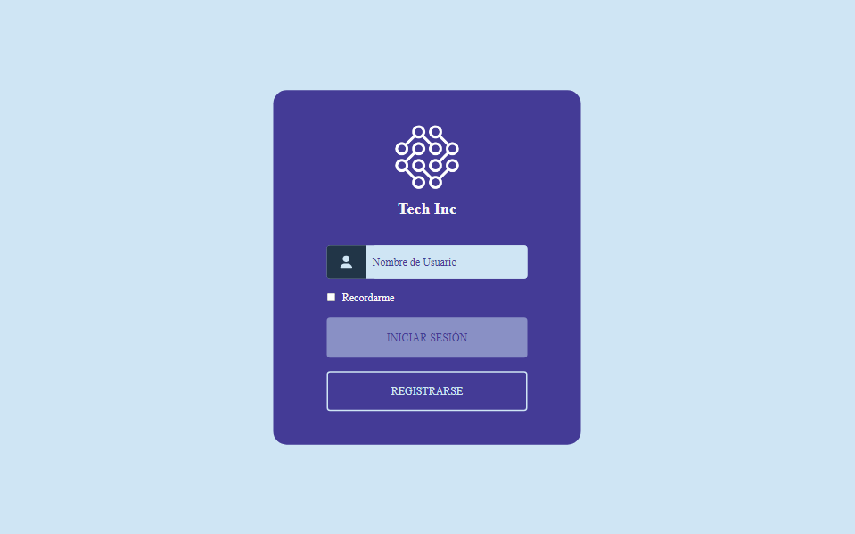
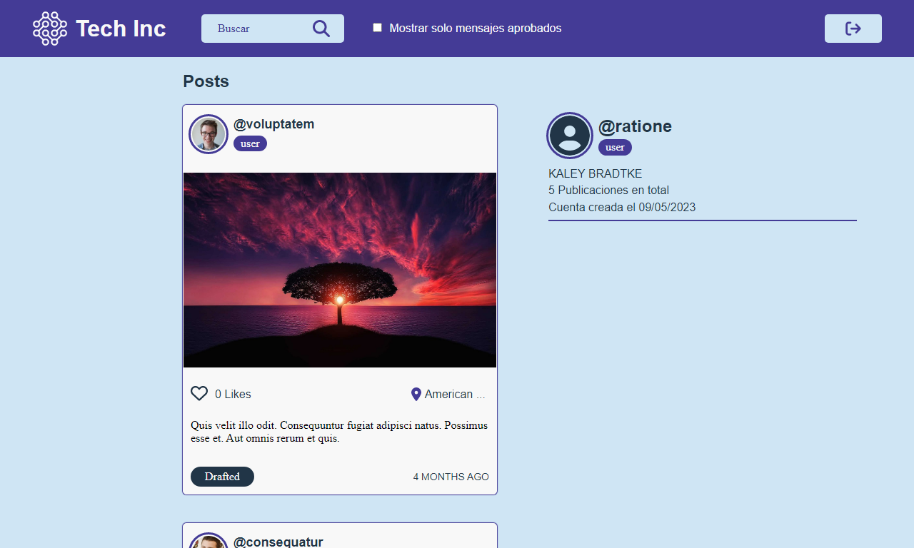

# Tech Posts Frontend

[](https://app.netlify.com/sites/tech-posts-demo/deploys)

<p align="center">
  <a href="https://reactjs.org/" target="blank"></a>
</p>

## Descripción

App Web para la administración de publicaciones.

Los datos son obtenidos desde una API desarrollada para este proyecto, puede ver el código aquí:
[https://github.com/EdixonAlberto/tech-posts-backend](https://github.com/EdixonAlberto/tech-posts-backend)

> **NOTA:** La url expuesta en este repositorio solo muestra una demo de la aplicación, la cual usa datos estáticos
> provenientes del siguiente archivo: [public/static/db.json](./public/static/db.json), por esto podrá visualizar los
> posts pero no podrá editarlos o crear nuevos.

## Inicio

Primero instale las depedencias con yarn y luego copie el [template](./.env.template) con las variables de entorno en la
raiz del proyecto y ejecute el comando `dev`.

```sh
yarn install
cp .env.template .env
yarn dev
```

## Comandos

```sh
# Ejecutar en modo desarrollo con "watch"
yarn dev

# Compilar proyecto
yarn build

# Previsualizar en modo producción
yarn preview

# Formatear todo el código usando prettier
yarn format

# Ejecutar el mockserver para probar el frontend
yarn serve

# Ejecutar en modo desarrollo la app junto al mockserver
yarn dev:mock

# Previsualizar en modo producción la app junto al mockserver
yarn preview:mock
```

## Contribuir

Realice un fork al proyecto en el branch `develop`, introdusca sus cambios y cree un `Pull Request` hacia el branch
`main`.

> NOTA: Este proyecto ha sido construido y probado usando el siguiente conjunto de tecnologías:

- node v18.13.0
- yarn v1.22.19
- vite v4.0.0
- React v18.2.0

## Vistas

- Signup



- Login



- Home


