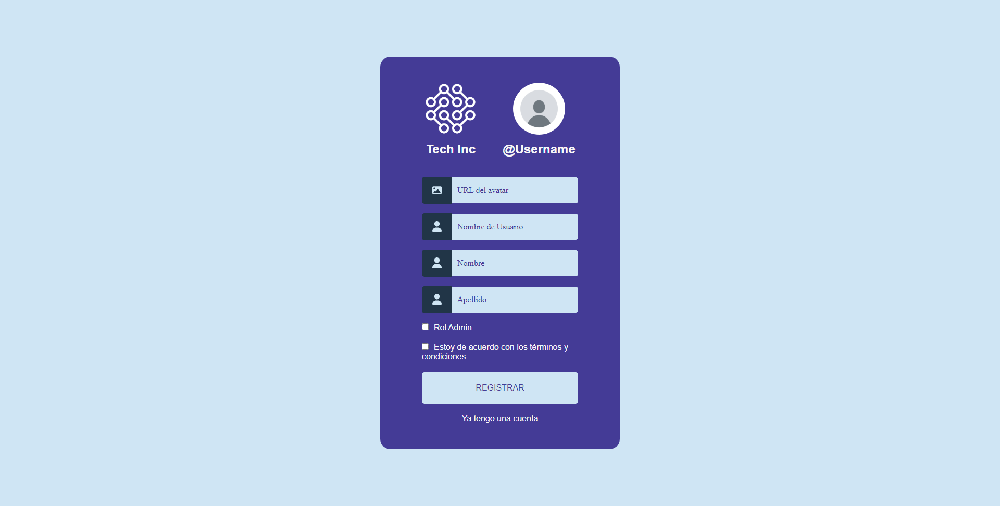

# Tech Posts Frontend

<p align="center">
  <a href="https://reactjs.org/" target="blank"></a>
</p>

## Descripción

App Web para la administración de publicaciones.

<!-- ### Web Demo &#x279c; []() -->

## Inicio

Para empezar primero instalale las depedencias con yarn, copie el [template](./.env.template) con las variables de entorno en la raiz del proyecto y ejecute el comando `dev`.

```bash
yarn install
cp .env.template .env
yarn dev
```

## Lista de Comandos

```bash
# Ejecutra en modo desarrollo con "watch"
yarn dev

# Compilar proyecto
yarn build

# Previsualizar en modo producción
yarn preview
```

## Contribuir

Realice un fork al proyecto en el branch `develop`, introdusca sus cambios y cree un `Pull Request` hacia el branch `main`.

> NOTA: Este proyecto ha sido construido y probado usando el siguiente conjunto de tecnologías:

- node v18.13.0
- yarn v1.22.19
- vite v4.0.0
- React v18.2.0

## Interfaces de usuario





